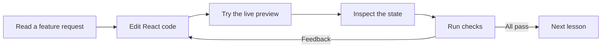
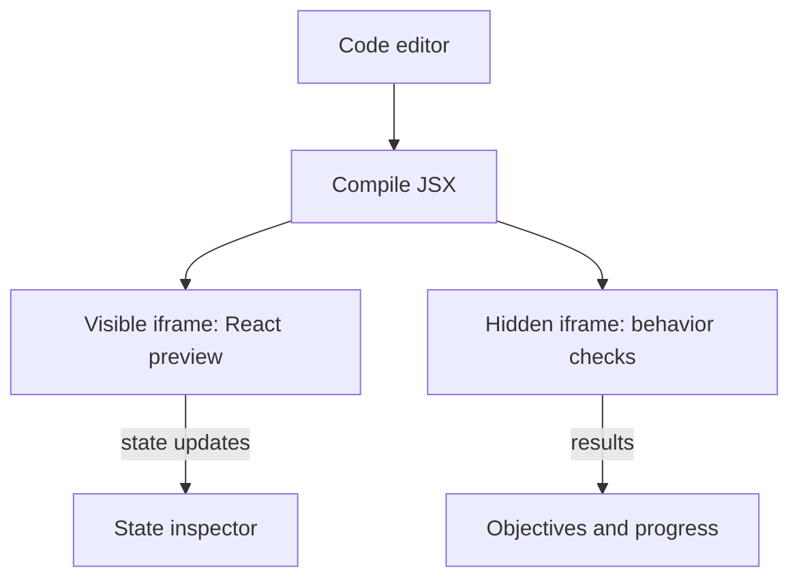

# State Quest

Learn React state by building working features in a settings panel, shopping cart, and task board. The code you edit is the code you see running.

**[Open the live code lab](https://mahfoudh.dev/code-craft-iii/#/lesson/1)**

## How the live code lab works



Each exercise starts with a small, incomplete React feature. You change its code, interact with the resulting UI, and use the state inspector and checks to understand the result. Checks accept equivalent working solutions, not one exact code answer.

## The sandbox at a glance



The preview and checks run your compiled code in separate sandboxed iframes. An iframe is a small page inside the app, so its React component has its own document and styles.

| Setting | Purpose |
| --- | --- |
| `sandbox="allow-scripts"` | Lets React and learner code run. |
| No `allow-same-origin` | Prevents direct access to the app's DOM, cookies, and saved progress. |
| `postMessage` | Sends state, errors, and check results back to the app. |

## What happens when you edit?

| You do this | The lab does this |
| --- | --- |
| Edit valid JSX | Compiles it after a short pause and swaps in a fresh preview. |
| Click inside the preview | Runs your handler and shows React's committed state. |
| Make a syntax error | Keeps the last working preview visible and shows the error. |
| Run checks | Mounts the same code in a hidden frame and tests each objective. |
| Refresh | Restores drafts, progress, and preferences from browser storage. |

<details>
<summary>Technical details</summary>

React, the frame runtime, checks, and styles are bundled into the iframe's inline document. Messages are validated by sender, format, and a per-frame token. Loop guards and timeouts help the lab recover from unresponsive code.

See [Workspace](src/ui/Workspace.tsx), [PreviewController](src/runtime/PreviewController.ts), [the compiler](src/runtime/compile.ts), and [the frame runtime](src/frame/runtime.ts).

</details>

## Curriculum

Nine lessons use the three mini-projects to teach state changes, `useState`, functional updates, props, one source of truth, immutable updates, lifting state, derived state, and state preservation.

## Run locally

Requires Node.js 22 or newer.

```sh
npm ci
npm run dev
```

Use `npm test` for the lesson and application checks, and `npm run build` to create the static site in `dist/`.

The site is deployed to GitHub Pages by [the GitHub Actions workflow](.github/workflows/deploy.yml).
